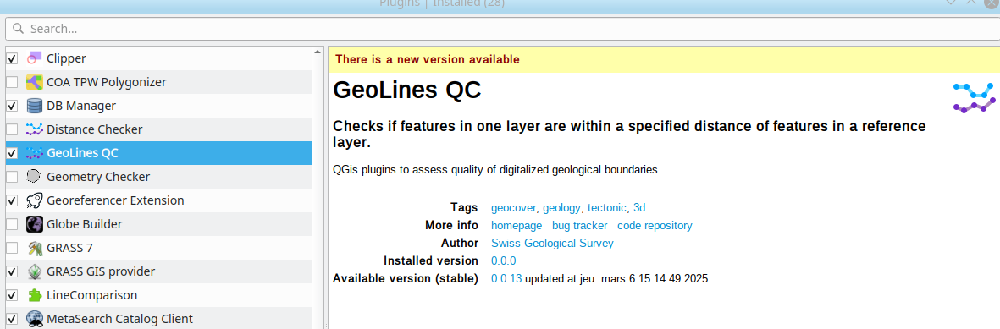
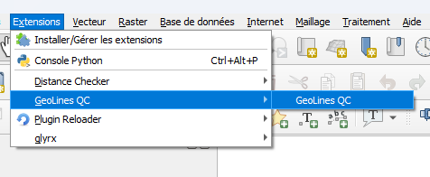
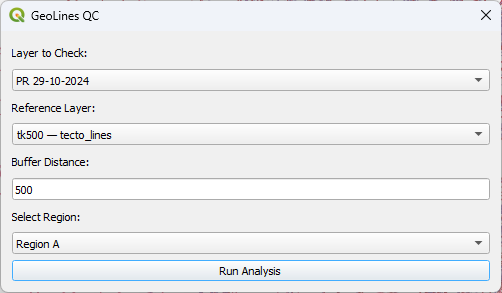
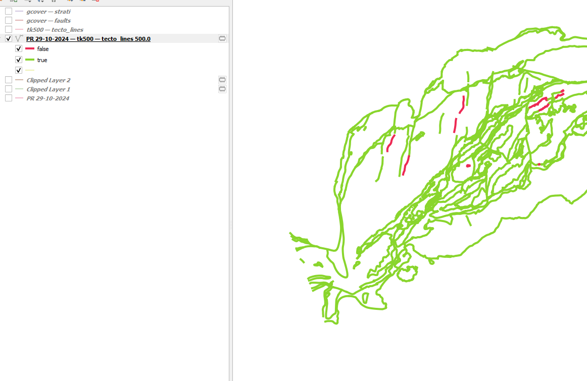

# lg-geolines-qc
QGis plugins to assess quality of digitalized geological lines boundaries against reference dataset.

## Installation

### From Zip archives

To install this plugin, you can download the zip file from the [releases](https://github.com/swisstopo/lg-geoline-qc/releases) page.

The direct download for the latest version at [here](https://github.com/swisstopo/lg-geoline-qc/releases/latest).

Once downloaded, go to  `Plugins -> Install and Manage Plugins... -> Install from ZIP`  and select the file
you just downloaded.

You can find the plugins directory by going to `Settings -> System -> Plugins`.

### Using a custom plugins repository

Add the custom plugin repository URL:
    https://dubious.cloud/qgis/plugins/plugins.xml

to
    `Plugins -> Install and Manage Plugins... -> Settings -> Plugins repositories -> Add`

You will be automatically notified if new version is published.

## Usage

Open the Plugin from the Menu bar

In the following dialog, choose:
* The layer to check
* The reference layer, usually Geocover or TK500
* The buffer distance, usually 100 meters for Geocover, 500 meters for TK500. Optional, default is 500 meters
* The mask region (Alps, Prealps)

A new temporary file with the combined name of the tested layer will be added to the project,
with a new field `intersects` set to `True/False`

