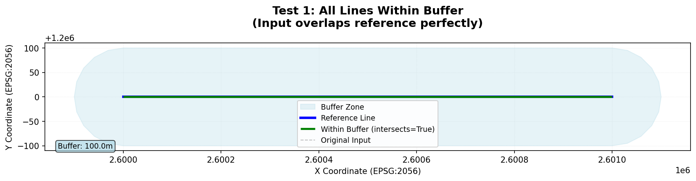
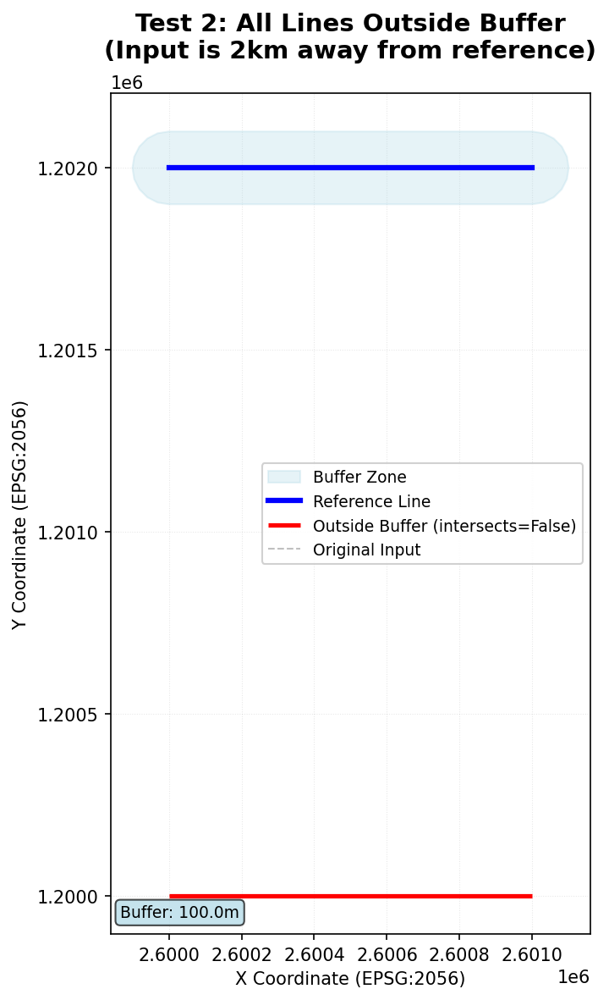
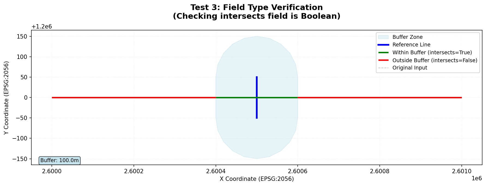
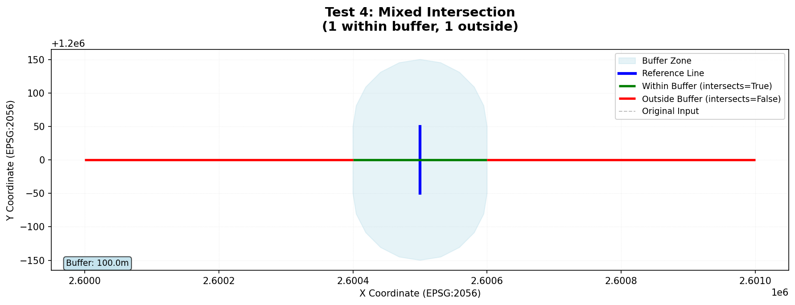
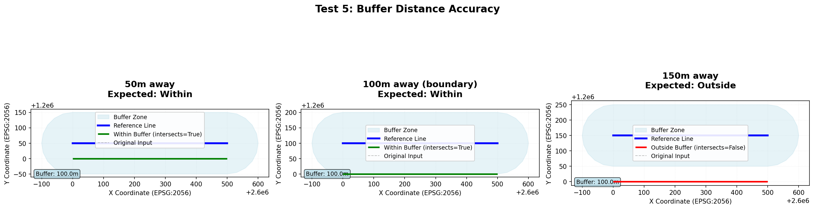
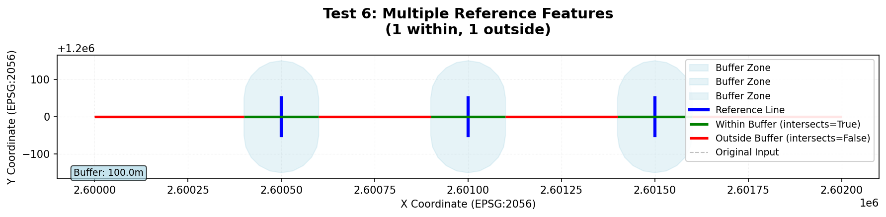
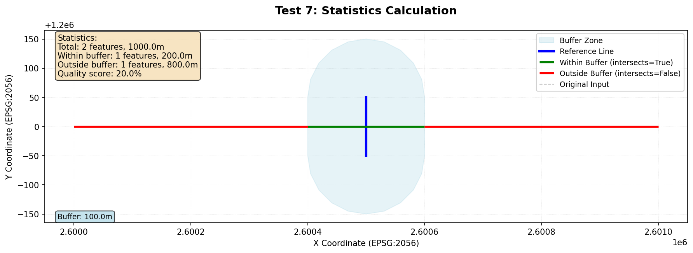
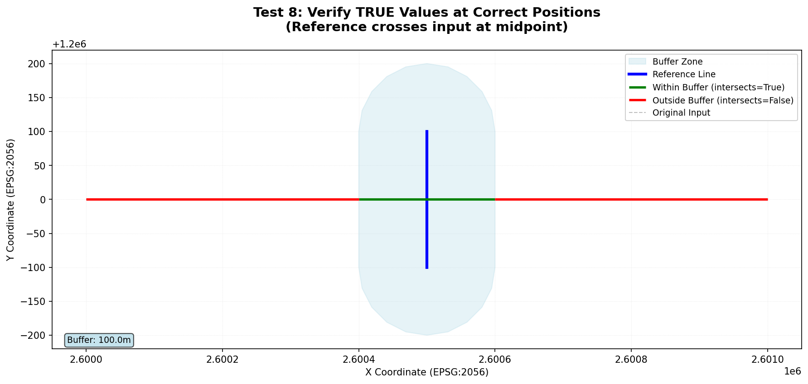
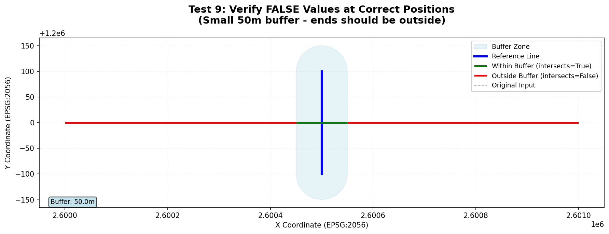
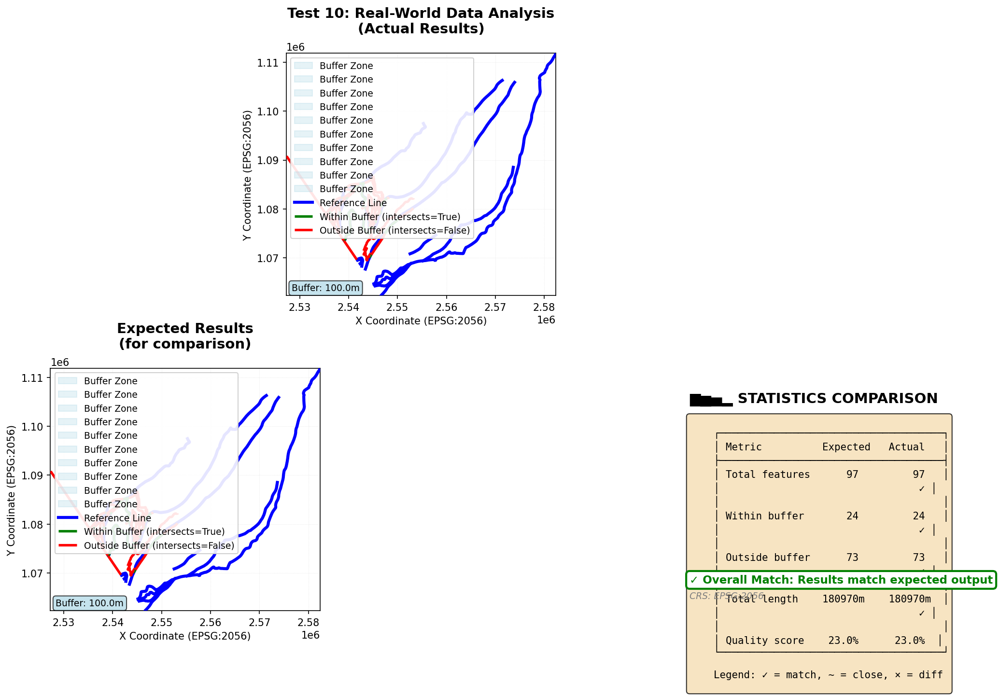

# TESTING.md

# Testing Documentation

This document describes how to set up and run tests for the GeoLines QC plugin.

## Setup

### Local Development Environment

The tests require QGIS Python bindings. The recommended setup uses conda:

```bash
# Create conda environment with QGIS
conda create -n qgis-dev -c conda-forge python=3.11 qgis pytest pytest-cov matplotlib -y
conda activate qgis-dev

# Verify installation
python -c "from qgis.core import QgsApplication; print('✓ QGIS imported successfully')"
```

### GitHub Actions CI/CD

Tests run automatically on push/pull requests using the workflow defined in `.github/workflows/testing.yaml`:

```yaml
name: QGIS Plugin Tests

on: [push, pull_request]

jobs:
  test:
    runs-on: ubuntu-latest
    
    container:
      image: qgis/qgis:release-3_34
    
    steps:
    - uses: actions/checkout@v3
    
    - name: Install dependencies
      run: |
        apt-get update
        apt-get install -y python3-pip
        pip3 install pytest pytest-cov pytest-qt matplotlib
    
    - name: Run tests
      env:
        QT_QPA_PLATFORM: offscreen
      run: |
        pytest tests/ -v --cov=GeoLinesQC --cov-report=xml
    
    - name: Upload coverage
      uses: codecov/codecov-action@v3
      with:
        file: ./coverage.xml
```

## Running Tests

### Run all tests

```bash
pytest tests/ -v
```

### Run specific test

```bash
pytest tests/test_geolines_qc.py::TestGeoLinesQC::test_simple_intersection_all_within_buffer -v
```

### Run with output and plots

```bash
pytest tests/test_geolines_qc.py -v -s
```

Test plots are saved to `tests/plots/`.

### Generate test data

```bash
python tests/create_test_data.py
```

### Validate real-world test data

```bash
python tests/validate_test_data.py
```

## Test Overview

### Test 1: All Lines Within Buffer

**Description:** Validates that when input lines perfectly overlap the reference lines, all segments are correctly identified as being within the buffer zone (intersects=True).

**What it tests:**
- Buffer creation around reference lines
- Intersection detection when lines overlap
- `intersects` field is set to True for all features



---

### Test 2: All Lines Outside Buffer

**Description:** Validates that when input lines are far from reference lines (2km away with only 100m buffer), all segments are correctly identified as outside the buffer zone (intersects=False).

**What it tests:**
- Lines clearly outside buffer are not marked as intersecting
- `intersects` field is set to False for all features
- Buffer distance accuracy



---

### Test 3: Field Type Verification

**Description:** Verifies that the `intersects` field exists in the output layer and has the correct Boolean data type.

**What it tests:**
- Field creation
- Field type (QVariant.Bool)
- Field naming



---

### Test 4: Mixed Intersection

**Description:** Tests a scenario where an input line crosses through a buffer zone, resulting in some segments within the buffer and some outside.

**What it tests:**
- Correct splitting of lines at buffer boundaries
- Mixed True/False values in output
- Line segmentation by intersection/difference operations



---

### Test 5: Buffer Distance Accuracy

**Description:** Tests the precision of buffer distance calculation by placing reference lines at exactly 50m, 100m, and 150m from input lines with a 100m buffer.

**What it tests:**
- Buffer distance accuracy
- Boundary conditions (lines exactly at buffer edge)
- Correct intersects values at different distances



---

### Test 6: Multiple Reference Features

**Description:** Validates correct handling when multiple reference lines are present, each creating their own buffer zones.

**What it tests:**
- Multiple buffer zones
- Correct intersection detection with multiple references
- Buffer merging/dissolving



---

### Test 7: Statistics Calculation

**Description:** Verifies that statistics (feature counts, lengths, quality scores) are calculated correctly.

**What it tests:**
- Total feature count
- Within/outside buffer counts
- Total length calculations
- Quality score computation (percentage within buffer)



---

### Test 8: TRUE Value Positions

**Description:** Verifies that segments marked with intersects=True are actually positioned within the buffer distance from reference lines.

**What it tests:**
- Spatial accuracy of True assignments
- Distance calculations
- No false positives



---

### Test 9: FALSE Value Positions

**Description:** Verifies that segments marked with intersects=False are actually positioned outside the buffer distance from reference lines.

**What it tests:**
- Spatial accuracy of False assignments
- Segments far from reference are correctly marked
- No false negatives



---

### Test 10: Real-World Data

**Description:** Validates the plugin against real-world data by comparing actual results with expected outputs.

**What it tests:**
- Complete workflow with real data
- Comparison with expected results
- Feature count matching
- Length calculations
- Quality score accuracy

**Required test data files** (in `tests/data/`):
- `test_lines.geojson` - Input lines to check
- `reference_lines.geojson` - Reference lines
- `result_lines.geojson` - Expected output with `intersects` field



The real-world test generates a comprehensive comparison showing:
- Top panel: Actual analysis results
- Bottom left: Expected results
- Bottom right: Statistics comparison table with match indicators

---

## Test Data Structure

### Synthetic Test Data

Simple geometric test cases are generated programmatically in the tests.

### Real-World Test Data

Real-world test data should be placed in `tests/data/`:

- **test_lines.geojson**: LineString features representing lines to be checked
- **reference_lines.geojson**: LineString features representing reference lines
- **result_lines.geojson**: Expected output with `intersects` Boolean field

All files should use the same CRS (e.g., EPSG:2056).

## Plot Legend

All test plots use consistent styling:

- 🔵 **Blue thick line**: Reference line(s)
- 💙 **Light blue zone**: Buffer zone
- 🟢 **Green lines**: Result segments with `intersects=True` (within buffer)
- 🔴 **Red lines**: Result segments with `intersects=False` (outside buffer)
- ⚫ **Gray dashed line**: Original input line (for reference)

## Coverage

Run tests with coverage report:

```bash
pytest tests/ --cov=GeoLinesQC --cov-report=html
```

View coverage report:

```bash
open htmlcov/index.html
```

## Troubleshooting

### QGIS Processing not initialized

If you get `QgsNotSupportedException: Processing plugin has not been loaded`:

```python
from processing.core.Processing import Processing
Processing.initialize()
```

This is handled automatically in `setUpClass()`.

### Missing test plots

Plots are only generated when tests run successfully. Check:
- `tests/plots/` directory exists
- Matplotlib is installed: `conda install matplotlib`

### Real-world test skipped

Ensure all three required GeoJSON files are present in `tests/data/`:

```bash
python tests/validate_test_data.py
```

---

**Last updated:** 2025-10-26